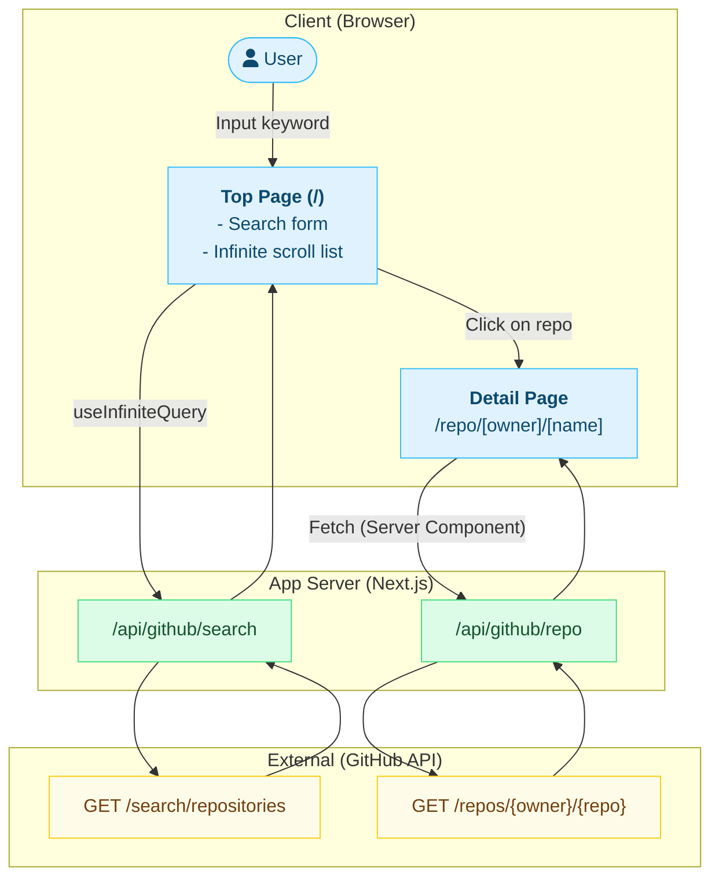

```mermaid
graph TD;
    %% Style
    classDef client fill:#e0f2fe,stroke:#38bdf8,color:#0c4a6e;
    classDef server fill:#dcfce7,stroke:#4ade80,color:#14532d;
    classDef external fill:#fefce8,stroke:#facc15,color:#713f12;

    subgraph "Client (Browser)"
        User(["fa:fa-user User"])
        SearchPage["<b>Top Page (/)</b><br/>- Search form<br/>- Infinite scroll list"]
        DetailPage["<b>Detail Page</b><br/>/repo/[owner]/[name]"]
    end

    subgraph "App Server (Next.js)"
        SearchAPI["/api/github/search"]
        RepoAPI["/api/github/repo"]
    end

    subgraph "External (GitHub API)"
        GH_Search["GET /search/repositories"]
        GH_Repo["GET /repos/{owner}/{repo}"]
    end

    %% Flow
    User -- "Input keyword" --> SearchPage
    SearchPage -- "useInfiniteQuery" --> SearchAPI
    SearchAPI --> GH_Search
    GH_Search --> SearchAPI
    SearchAPI --> SearchPage

    SearchPage -- "Click on repo" --> DetailPage
    DetailPage -- "Fetch (Server Component)" --> RepoAPI
    RepoAPI --> GH_Repo
    GH_Repo --> RepoAPI
    RepoAPI --> DetailPage

    %% Assign classes
    class User,SearchPage,DetailPage client;
    class SearchAPI,RepoAPI server;
    class GH_Search,GH_Repo external;
```
