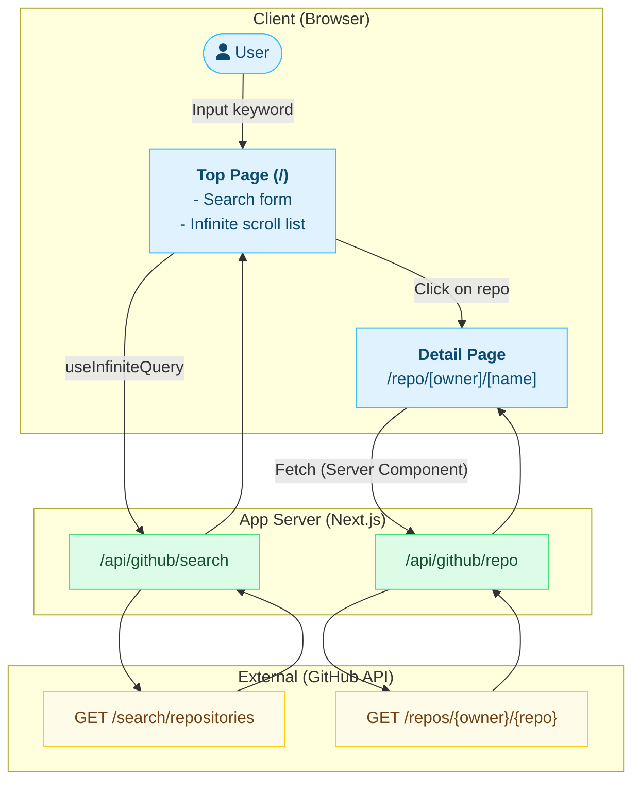

# GitHub Repository Search App

GitHubのリポジトリを検索し、詳細情報を閲覧できるWebアプリケーションです。Next.js（App Router）、TypeScript、Tailwind CSS、TanStack Queryを使用した最小構成の実装です。

## 概要

### 主な機能

- **キーワード検索**: GitHubリポジトリをリアルタイムで検索
- **無限スクロール**: 検索結果を自動的に追加読み込み
- **詳細表示**: リポジトリの詳細情報（Star数、Fork数、Issue数など）を表示

### 技術スタック

- **Runtime**: Node.js (最新LTS)
- **Framework**: Next.js 15.3.4 (App Router)
- **Language**: TypeScript 5
- **Styling**: Tailwind CSS 4 + shadcn/ui
- **Data Fetching**: TanStack Query
- **Testing**: Jest + React Testing Library

## セットアップ

### 必要な環境

- Node.js LTS版（推奨: nvmを使用）
- npm
- GitHub Personal Access Token (PAT)

### インストール手順

1. リポジトリをクローン

```bash
git clone https://github.com/yasudakeisuke/github_repo_search_app.git
cd github_repo_search_app
```

2. Node.jsのバージョンを設定

```bash
nvm install --lts
nvm use
```

3. 依存関係をインストール

```bash
npm install
```

4. 環境変数を設定
   `.env.example`をコピーして`.env.local`を作成し、GitHub Personal Access Tokenを設定します。

```bash
cp .env.example .env.local
```

`.env.local`を編集：

```
GH_PAT=your_github_personal_access_token_here
```

> **Note**: GitHub PATは[こちら](https://github.com/settings/tokens)から`repo`スコープで発行できます。

5. 開発サーバーを起動

```bash
npm run dev
```

ブラウザで http://localhost:3000 を開きます。

## 開発フロー

### 利用可能なスクリプト

```bash
# 開発サーバーの起動
npm run dev

# プロダクションビルド
npm run build

# プロダクションサーバーの起動
npm start

# Lintの実行
npm run lint

# テストの実行
npm test

# CI環境でのテスト実行
npm run ci
```

### ディレクトリ構成

```
src/
├── app/                    # Next.js App Router
│   ├── page.tsx           # トップページ（検索画面）
│   ├── repo/              # リポジトリ詳細ページ
│   └── api/github/        # GitHub API エンドポイント
├── components/            # Reactコンポーネント
│   ├── SearchBar.tsx      # 検索バー
│   ├── RepoList.tsx       # リポジトリ一覧（無限スクロール）
│   └── RepoDetailCard.tsx # リポジトリ詳細カード
├── lib/                   # ユーティリティ
│   ├── github.ts         # GitHub API クライアント
│   └── types.ts          # TypeScript型定義
└── __tests__/            # テストファイル
```

## アーキテクチャ



### データフロー

1. **検索**: ユーザーがキーワードを入力すると、URLクエリパラメータが更新されます
2. **API呼び出し**: TanStack QueryのuseInfiniteQueryが`/api/github/search`を呼び出します
3. **無限スクロール**: IntersectionObserverが画面下部を検知し、次のページを自動読み込みします
4. **詳細表示**: リポジトリカードをクリックすると、Server Componentが詳細情報を取得して表示します

## AI開発支援の活用方法

このプロジェクトはAI（Cursor）を活用して開発されています。効率的な開発のためのTips：

### Cursorでの開発

1. **コンテキスト共有**: `.cursor/rules/`ディレクトリにプロジェクトのアーキテクチャや設計書を配置
2. **タスク管理**: フェーズごとの実装設計書を参照しながら開発
3. **テスト駆動開発**: AIにテストケースを先に生成させてから実装

### 推奨される活用方法

- **コード生成**: コンポーネントやAPIルートの雛形生成
- **リファクタリング**: TypeScriptの型安全性向上やパフォーマンス最適化
- **ドキュメント作成**: コードコメントやREADMEの自動生成
- **バグ修正**: エラーメッセージを共有して解決策を提案

## テスト

### ユニットテスト

```bash
npm test
```

### 手動E2Eテスト

MCPのPlaywrightツールを使用して、以下のシナリオをテスト：

1. 検索機能の動作確認
2. 無限スクロールの動作確認
3. 詳細ページへの遷移と戻る動作

## CI/CD

GitHub Actionsを使用した自動テスト：

- Lintチェック（警告0件）
- ユニットテスト実行
- Node.js LTS版で実行
